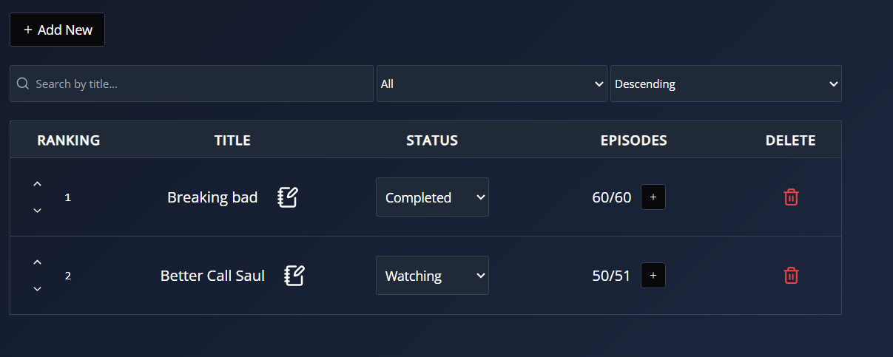
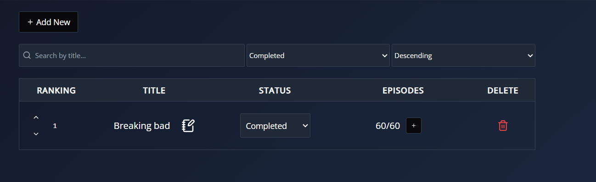

# Series Tracker API

## Descripción

La **Series Tracker API** es una aplicación RESTful desarrollada en Go para gestionar un backlog de series. Permite realizar operaciones CRUD (crear, leer, actualizar y eliminar series) y actualizaciones parciales (usando PATCH) en campos específicos, tales como:
- **Status**: Actualizar el estado de una serie.
- **Episode**: Incrementar el número del último episodio visto.
- **Upvote/Downvote**: Incrementar o disminuir la puntuación (ranking) de una serie.

Además, el proyecto incluye un frontend (ubicado en la carpeta `static`) que consume esta API para mostrar, filtrar, ordenar y actualizar la información de las series.

---

## Endpoints de la API

La API se encuentra disponible en `http://localhost:8080/api` y cuenta con los siguientes endpoints:

### Endpoints Básicos

- **GET /api/series**  
  **Descripción:** Obtiene la lista de series.  
  **Parámetros de query (opcional):**
  - `search`: Texto para buscar en el título.
  - `status`: Filtrar por estado (por ejemplo, "Watching", "Completed", etc.).
  - `sort`: Ordenar por ranking; valores posibles: `asc` o `desc`.

- **GET /api/series/{id}**  
  **Descripción:** Obtiene los detalles de la serie con el ID especificado.

- **POST /api/series**  
  **Descripción:** Crea una nueva serie.  
  **Body JSON Ejemplo:**
  ```json
  {
    "title": "Mi Serie",
    "status": "Watching",
    "lastEpisodeWatched": 0,
    "totalEpisodes": 10,
    "ranking": 5
  }

- **PUT /api/series/{id}**  
  **Descripción:** Actualiza por completo una serie existente.

- **DELETE /api/series/{id}**  
  **Descripción:** Elimina la serie especificada.

## Endpoints de la API

- **PUT /api/series/{id}**  
  **Descripción:** Actualiza por completo una serie existente.

- **PATCH /api/series/{id}/status**  
  **Descripción:** Actualiza el estado de la serie.
  **Body JSON Ejemplo:**
  ```json
  {
  "status": "Completed"
  }
  
- **PATCH /api/series/{id}/episode**  
  **Descripción:** Incrementa el campo lastEpisodeWatched en 1.

- **PATCH /api/series/{id}/upvote**  
  **Descripción:** Incrementa el ranking en 1.

- **PATCH /api/series/{id}/downvote**  
  **Descripción:** Decrementa el ranking en 1.

## Configuración y Ejecución

### Variables de entorno

La API utiliza las siguientes variables de entorno, con los siguientes valores por defecto:

- **DB_USER**: Usuario de la base de datos (default: "root")
- **DB_PASS**: Contraseña de la base de datos (default: "password")
- **DB_HOST**: Host de la base de datos (default: "mariadb")
- **DB_PORT**: Puerto de la base de datos (default: "3306")
- **DB_NAME**:  Nombre de la base de datos (default: "series_db")

Estas variables pueden configurarse en el entorno o a través del archivo docker-compose.yml.

### Uso con Docker

El proyecto incluye un Dockerfile y un docker-compose.yml que orquesta el backend y la base de datos MariaDB. 

1. Detén y elimina contenedores y volúmenes previos (si existen): docker-compose down -v
2. Construye y levanta la aplicación: docker-compose up --build

Esto iniciará el backend en el puerto 8080 y la base de datos en el puerto 3306.

## Frontend

Los archivos del frontend se encuentran en la carpeta static y se sirven como la raíz del servidor.

http://localhost:8080/index.html

El frontend consume la API para mostrar, filtrar, ordenar y actualizar la información de las series.

## Documentacion del codigo

Cada endpoint y función del proyecto está debidamente comentado en el código fuente. Los handlers para cada operación (GET, POST PUT, DELETE y PATCH) incluyen explicaciones sobre su funcionamiento. Además, se han creado módulos en el frontend (por ejemplo, getSeriesList.js, updateRanking.js, etc.) que facilitan la interacción con la API.

## Pruebas






---

### Archivo llms.txt

```txt
Uso de la API Series Tracker

1. Configuración:
   - La API se ejecuta en http://localhost:8080.
   - Configura las siguientes variables de entorno si es necesario:
       DB_USER (default: "root")
       DB_PASS (default: "password")
       DB_HOST (default: "mariadb")
       DB_PORT (default: "3306")
       DB_NAME (default: "series_db")
   - Levanta la aplicación con Docker:
       docker-compose down -v
       docker-compose up --build

2. Endpoints Principales:
   - GET /api/series:
       Obtiene la lista de series.
       Parámetros opcionales:
         * search: Texto para buscar en el título.
         * status: Filtrar por estado (ej: "Watching", "Completed").
         * sort: Ordenar por ranking ("asc" para ascendente, "desc" para descendente).
   - GET /api/series/{id}:
       Obtiene la serie con el ID especificado.
   - POST /api/series:
       Crea una nueva serie.
       Ejemplo de JSON:
       {
         "title": "Mi Serie",
         "status": "Watching",
         "lastEpisodeWatched": 0,
         "totalEpisodes": 10,
         "ranking": 5
       }
   - PUT /api/series/{id}:
       Actualiza completamente una serie existente.
   - DELETE /api/series/{id}:
       Elimina la serie indicada.

3. Endpoints Parciales (PATCH):
   - PATCH /api/series/{id}/status:
       Actualiza el estado de la serie.
       Body Ejemplo: { "status": "Completed" }
   - PATCH /api/series/{id}/episode:
       Incrementa el campo lastEpisodeWatched en 1.
   - PATCH /api/series/{id}/upvote:
       Incrementa el ranking en 1.
   - PATCH /api/series/{id}/downvote:
       Decrementa el ranking en 1.

4. Uso del Frontend:
   - Los archivos del frontend se encuentran en la carpeta "static" y se sirven como la raíz.
   - Accede a la aplicación en http://localhost:8080/index.html.
   - El frontend consume la API para mostrar, filtrar y actualizar la información de las series.

5. Consideraciones:
   - La API admite CORS, permitiendo el acceso desde diferentes orígenes.
   - La documentación completa de la API y ejemplos de uso se encuentran en este archivo y en el README.
